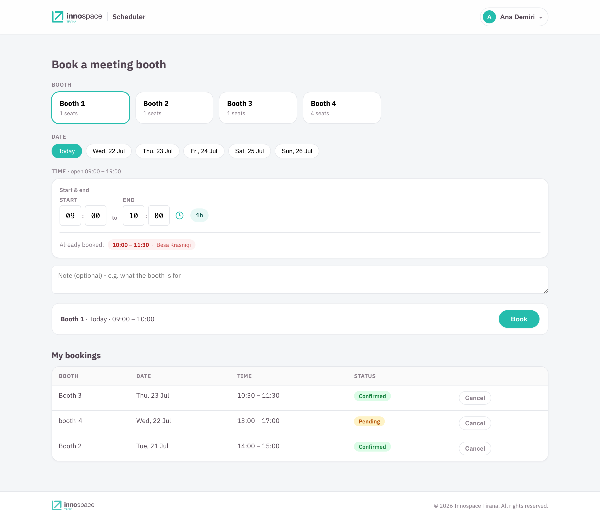
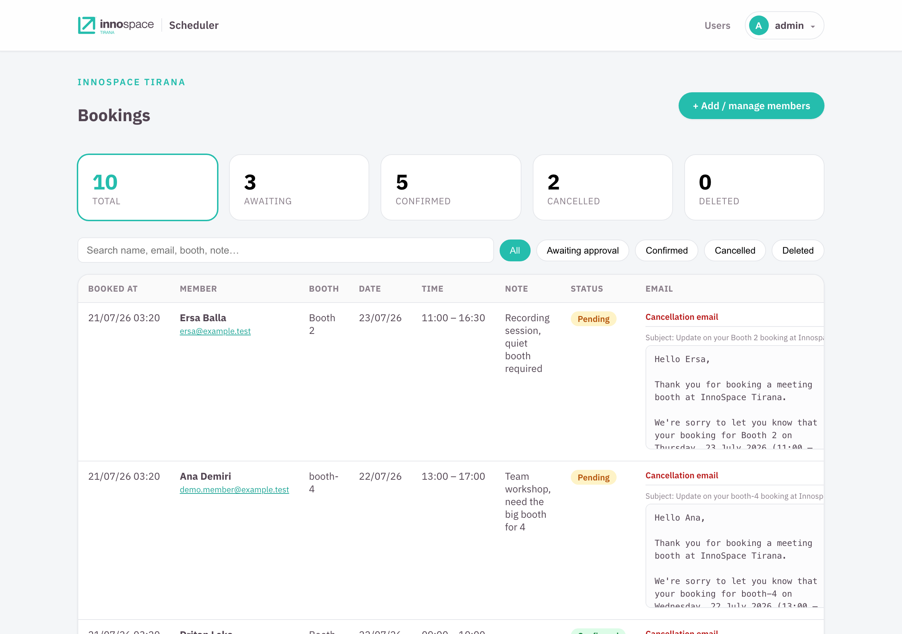
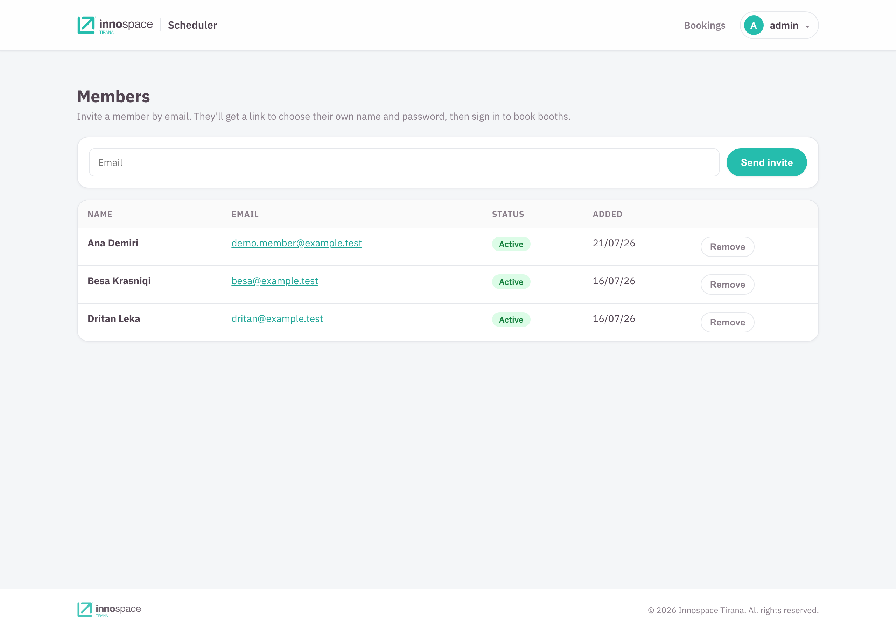
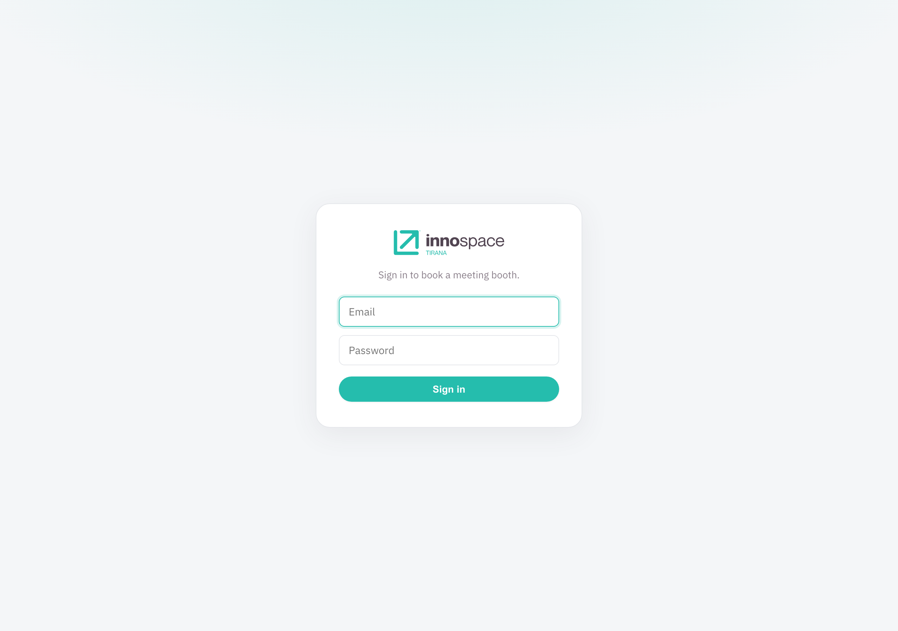

# Innospace Scheduler

A self-service scheduler for reserving Innospace Tirana's **meeting booths**. Members
sign in, pick a booth and a time range, and the reservation is held the moment they
submit (with server-side double-reservation prevention). An admin manages members and
every reservation from a dashboard.

Built with Next.js 15 (App Router), React 19, TypeScript, and SQLite
(`better-sqlite3`), with transactional email through Resend and a one-command
deploy to Fly.io.

<p align="center">
  
</p>

## Features

- **Arbitrary time ranges**, not fixed slots. A reservation is a start and end
  datetime; times snap to a configurable step (default 5 min) with a configurable
  minimum length (default 15 min), inside the open hours.
- **No double-reservation.** Overlaps are rejected atomically inside a DB transaction,
  so two people racing for the same slot cannot both win. Ranges are half-open, so
  10:00-11:00 and 11:00-12:00 do not clash.
- **Approval for long reservations.** Anything longer than `AUTO_APPROVE_MAX_HOURS`
  is created as `pending` (which still holds the slot) and must be approved by the
  admin; a note is required at or over that length.
- **Invite-only members.** The admin enters an email; the member sets their own
  name and password from a tokenised activation link.
- **Transactional email** (Resend): invitations, reservation confirmations,
  pending-request notices, and cancellations.
- **Admin dashboard** to approve, cancel, or delete reservations and to invite or
  remove members.
- **Typed time picker** built on Tailwind CSS and shadcn/ui: type the digits,
  arrow up/down to step, arrow left/right to move between fields.

## How reservations work

- A reservation is stored as `startsAt` / `endsAt` local wall-clock strings
  (`"YYYY-MM-DDTHH:MM"`). Set `TZ` so the server agrees with the space.
- Members reserve from today up to `RESERVATION_WINDOW_DAYS` ahead. Times already passed
  are not offered.
- `ACTIVE_STATUSES` = `confirmed` + `pending`: a pending reservation holds the slot
  exactly like a confirmed one. Cancelled and deleted reservations free it.
- The picker only collects the two times. Opening hours, the step grid, the
  minimum length, and clashes are enforced by the reservation form and, definitively,
  by the API route and the database.

## Roles

- **Members** are invited by the admin (by email), then activate their account
  from a tokenised link (valid for `INVITE_TTL_DAYS`) where they set their name and
  password. They sign in at `/login`, reserve booths, and see or cancel their own
  reservations.
- **Admin** signs in with the env `DASHBOARD_USERNAME` / `DASHBOARD_PASSWORD`, sees
  every reservation, approves or cancels (emailing the member) or deletes, and
  manages members from the **Users** page.

The admin dashboard lists every reservation with live status counts, a search box,
status filters, and a preview of the exact email each action would send:

<p align="center">
  
</p>

Members are invite-only and managed from the **Users** page: enter an email, and
the member sets their own name and password from the activation link.

<p align="center">
  
</p>

## Tech stack

| Component | Notes |
| --- | --- |
| Next.js 15 (App Router) | `output: "standalone"`, React strict mode |
| React 19 + TypeScript (strict) | |
| better-sqlite3 | Synchronous SQLite, WAL mode, one file on a volume |
| Tailwind CSS + shadcn/ui | The time picker only; the rest is hand-written CSS |
| Resend | Transactional email |
| Fly.io + Cloudflare | SQLite on a Fly volume; Cloudflare in front |

## Getting started

```bash
make setup                # creates .env from .env.example, installs deps
# then fill in .env (see Configuration)
make dev                  # http://localhost:4001
```

Sign in at `/login` as the admin (the `DASHBOARD_*` values), open **Users** to
invite a member, then activate that member and reserve.

<p align="center">
  
</p>

Without `RESEND_API_KEY` set, emails are skipped, so locally the invitation is not
delivered: grab the activation link from the server logs (or the token in the DB)
to complete a member's setup.

`make help` lists convenience targets (`make dev`, `make check`, `make docker-up`).

## Configuration

Copy `.env.example` to `.env`. It documents every variable; the ones you must set
for anything beyond local dev:

| Var | Purpose |
| --- | --- |
| `AUTH_SECRET` | Signs login session cookies. Use a long random string. |
| `DASHBOARD_USERNAME` / `DASHBOARD_PASSWORD` | Admin login. Change the defaults. |
| `RESEND_API_KEY` / `EMAIL_FROM` | Sending email (skipped if the key is unset). |
| `APP_BASE_URL` / `EMAIL_LOGO_URL` | Links and logo in emails. Must be publicly reachable. |
| `TZ` | Timezone for the day boundary (e.g. `Europe/Tirane`). |
| `DATA_FILE` | SQLite path (default `./data/scheduler.db`). |

Scheduling knobs (all optional, with sensible defaults): `OPEN_HOUR`,
`CLOSE_HOUR`, `TIME_STEP_MINUTES`, `MIN_RESERVATION_MINUTES`, `RESERVATION_WINDOW_DAYS`,
`AUTO_APPROVE_MAX_HOURS`, `INVITE_TTL_DAYS`. Booths come from `SCHEDULER_BOOTHS`
(`id:Name:capacity`, comma-separated); omit it for the built-in defaults.

**Login brute-force protection** (see `src/lib/rate-limit.ts`) uses two buckets,
because the whole coworking space shares one public IP:

| Var | Purpose |
| --- | --- |
| `LOGIN_MAX_ATTEMPTS` | Per-account failures before an escalating lockout (default `5`). The account is **never** permanently banned, so an attacker can't lock a member out for good. |
| `LOGIN_BLOCK_SECONDS` | Base lockout seconds; escalates ×N per lockout (default `60`). |
| `LOGIN_IP_MAX_ATTEMPTS` | Per-IP failures (across any accounts) before an IP lockout (default `20`, tolerant of the shared office IP). |
| `LOGIN_IP_BLOCK_SECONDS` | Per-IP base lockout seconds (default `60`). |
| `LOGIN_MAX_LOCKOUTS` | Per-IP lockouts before the IP is banned outright until restart (default `10`). |

State is in-memory per-process: not shared across machines or persisted across
restarts, which is fine for a single Fly machine.

Secrets live only in `.env` (gitignored) locally and in `fly secrets` in
production. They are never committed.

## Deploy (Fly.io)

`fly.toml` targets the `innospace-scheduler` app in region `fra`, with a 1 GB
volume (`scheduler_data`) mounted at `/app/data` for the SQLite file. It holds
**only non-sensitive infrastructure**, with **no `[env]` block**: every
runtime variable (paths, sender, base URL, scheduling window, booths, login
throttling, credentials, API keys) is stored as an **encrypted Fly secret**, so
nothing environment-specific or sensitive is committed. `.env.example` is the
human-readable catalogue of every var.

```bash
# All runtime config is a secret. Set each var from .env.example, e.g.:
fly secrets set \
  AUTH_SECRET="$(openssl rand -hex 32)" DASHBOARD_USERNAME=admin DASHBOARD_PASSWORD='…' \
  RESEND_API_KEY=re_xxx EMAIL_FROM='scheduler@innospacetirana.com' \
  APP_BASE_URL='https://scheduler.innospacetirana.com' NODE_ENV=production PORT=4001 \
  HOSTNAME=0.0.0.0 TZ=Europe/Tirane DATA_FILE=/app/data/scheduler.db \
  LOGIN_MAX_ATTEMPTS=5 LOGIN_BLOCK_SECONDS=60 \
  LOGIN_IP_MAX_ATTEMPTS=20 LOGIN_IP_BLOCK_SECONDS=60 LOGIN_MAX_LOCKOUTS=10
fly deploy
```

To read or change a value later, use `fly secrets list` (names only) and
`fly secrets set KEY=value` (triggers a rolling restart). There is no plaintext
`[env]` to edit. Pushing to `master` also deploys via GitHub Actions, which needs
a `FLY_API_TOKEN` repository secret.

The SQLite schema is versioned with `PRAGMA user_version` and applied by an
ordered list of migrations in `src/lib/db.ts` (`MIGRATIONS`). On first query the
DB runs every migration newer than its current version, each in a transaction, so
a fresh DB is built and an existing one is upgraded in place: no manual step, no
data loss. To change the schema, **append** a new `{ version, up }` entry with the
`ALTER`/`CREATE` statements; never edit one that has already shipped.

## Project layout

```
src/lib/           booths, schedule window, types, db (reservations + users),
                   auth (roles + scrypt), email, templates, cors
src/app/           / (member reservation), /login, /dashboard and /users (admin),
                   /activate (member setup), /api/{login,availability,
                   reservations,users,activate}
src/components/ui/ shadcn Input + the typed time-picker field
tests/             unit / integration / functional (Vitest)
```

## Testing

Unit, integration, and functional tests run on [Vitest](https://vitest.dev):

```bash
make test            # run the suite once
make test-watch      # watch mode
make coverage        # V8 coverage report
```

- **Unit** cover the pure logic (schedule/time rules, auth tokens + scrypt,
  templates, booths, the time-picker helpers, cors).
- **Integration** exercise `db.ts` against a throwaway SQLite file per test
  (overlap atomicity, the member lifecycle).
- **Functional** drive each API route handler end to end (validation, status
  codes, auth scoping, cookies), with email and the clock stubbed.

Tests never touch your dev database or send real email. They live in `tests/`
and are type-checked on their own (`tsconfig.tests.json`), so they stay out of
`next build`.

## Scripts

`npm run dev` (port 4001) - `npm run lint` - `npm run typecheck` -
`npm run test` - `npm run format` - `npm run build` / `npm run start`
(production).

`make check` runs the whole gate (format, lint, types, and the test suite);
`make fmt` auto-fixes formatting and lint.

## License

The code is open source under the [Apache License 2.0](LICENSE). You may use,
modify, self-host, and redistribute it, including commercially.

The **name and branding are reserved.** "Innospace Scheduler", the "InnoSpace"
name, and the InnoSpace Tirana logos are trademarks of InnoSpace Tirana and are
not covered by the code license. No white-labeling: a public fork must ship
under a different name. See [TRADEMARK.md](TRADEMARK.md) for details.

## Contributing and security

See [CONTRIBUTING.md](CONTRIBUTING.md) to get set up and submit changes, and
[SECURITY.md](SECURITY.md) to report a vulnerability privately.
